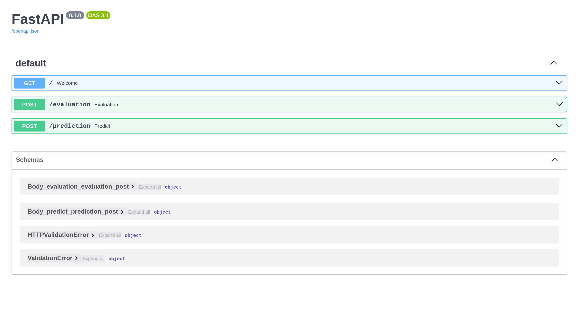
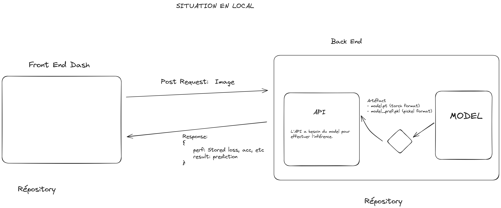
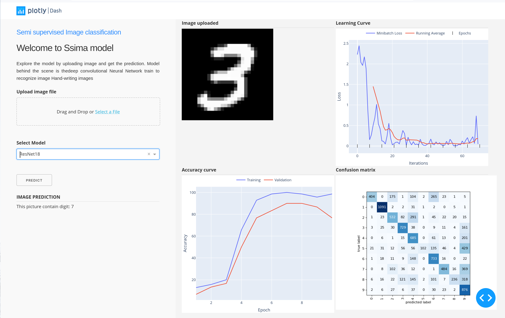

# SsIma API
SsIma API aim to implement API in order to serve all model implement in [s3ima](https://github.com/goamegah/s3ima).
After, I containerize api using docker.

## Table des Matières

1. [Introduction](#introduction)
2. [API documentation interface](#api-documentation-interface)
2. [Project workflows](#project-workflows)
3. [Run model](#run-api)

---

## Introduction
Project concerns of implementing simple deep learning architecture
for classifying ```MNIST``` image data with two constraints
- Train model with only 100 labels samples:
- Implement API to serve model functionality
- Implement Web App (as client) to display model performance.

**API** will be used to serve model by exposing two functionalities:
- Receiving request that will contains image from a **Frontend app** 
which (assuming) to be digit image and ```model name```.
- Response by posting **inference result** and ***model evaluation metrics*** as graph.

Project workflow below, will help user understanding where APi will take part
and its roles. (Comments use French language)

---
**Attention:** _This part of project concerns only API implementation and deployment as service
using Docker_. 
---

**Requirements for Running whole process (Front-API-Model):**

- For having a look on model's implementation, you will need to refere to [s3ima](https://github.com/goamegah/s3ima)
project. Obviously, you don't need to have s3ima code for testing API due to prior availability of artefact inside 
**artefact/** folder.

- You will probably need to have Dash web app implementation on local. So you can get code 
from [s3ima-app](https://github.com/goamegah/ssima-app)


## Api documentation interface:

Here is how API interface will look like.




## Project workflows:



Dash web app (ssima-app) depend on API (s3ima-api) results from model (s3ima). 
To simplify process all artefact is prior available through **artefact/** folder. 


Api server will be waiting for request (eg. image) send by front (Dash App) and 
will get and process image, feed model, get result from it and finally sent results 
to the front (dash web app) .




## Run API
Please before going on, make sure having installed ```uvicorn```, ```python-multipart``` and ```torch```.
If not, you can require librairy by run ```pip install -r requirements.txt```


In the root of project can launch model API by using following command

```shell
$  uvicorn api:app --reload
```

After this you can open your navigator and tape this link: ```http://127.0.0.1:8000/``` 


## Containerize app with Docker
for containerize API app, **dockerfile** is available for building and deploy image

```shell
$ docker build -t image_name:version .
$ docker run -p 8000:8000 image_name:version
```
